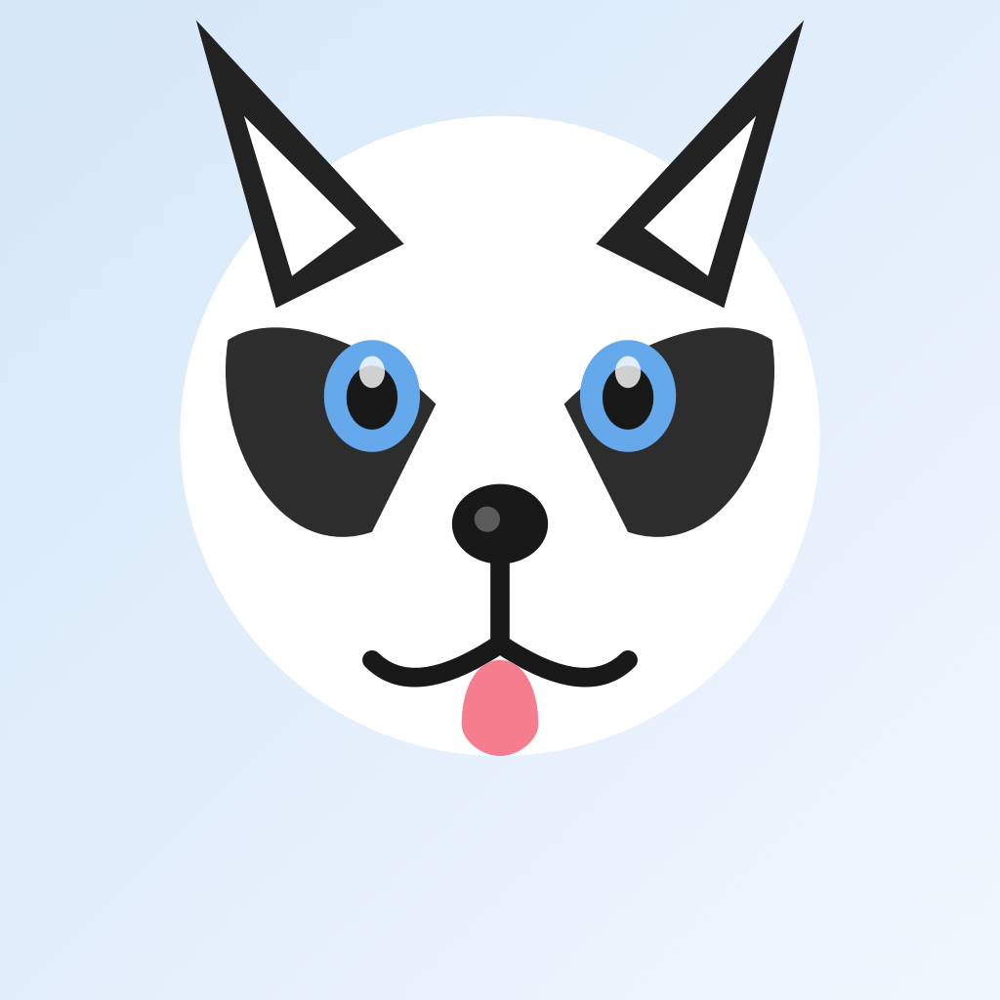

# 🐕 MyDesktopPet

<div align="center">

A cute macOS desktop pet app with smooth Lottie animations to make your desktop more fun!



[](https://opensource.org/licenses/MIT)
[](https://www.apple.com/macos/)
[](https://swift.org/)

</div>

---

## ✨ Features

- 🎨 **Lottie Animation Support** - Smooth vector animations with no quality loss
- 🐾 **Built-in Cute Animations** - Two adorable dog animations included
- 📁 **Custom Animation Import** - Import your own Lottie JSON files
- 🔄 **Proportional Scaling** - Five scaling levels: 50%, 75%, 100%, 150%, 200%
- 🪟 **Transparent Floating Window** - Borderless, always on top
- 🖱️ **Draggable** - Move your pet anywhere on the desktop
- 📍 **All Desktop Spaces** - Visible across all virtual desktops
- 🎯 **Menu Bar Control** - Paw print icon with full menu control

## 📸 Demo

<div align="center">


*Cute corgi running on your desktop!*

</div>

## 🚀 Quick Start

### Option 1: Download Release (Recommended)

1. Download the latest `MyDesktopPet.dmg` from [Releases](../../releases)
2. Open the DMG file and drag the app to Applications folder
3. Double-click to run

### Option 2: Build from Source

**Requirements:**
- macOS 13.0+
- Xcode Command Line Tools or full Xcode

**Build Steps:**

```bash
# 1. Clone repository
git clone https://github.com/alpacachen/MyDesktopPet.git
cd MyDesktopPet

# 2. Build the app
swift build -c release

# 3. Package the app (optional)
./Scripts/build.sh
```

## 📖 Usage

### Basic Operations

- **Move Pet**: Click and drag the pet to anywhere
- **Switch Animation**: Click menu bar paw icon 🐾, select animation
- **Adjust Size**: Menu Bar > Scale > Select size
- **Import Custom Animation**: Menu Bar > Import Animation, select Lottie JSON file
- **Hide Pet**: Menu Bar > Show/Hide
- **Quit App**: Right-click pet > Quit

### Custom Animations

Import any Lottie JSON animation:

1. Download animations from [LottieFiles](https://lottiefiles.com)
2. Click menu bar icon > "Import Animation"
3. Select `.json` file

**Storage Locations:**
- Built-in animations: `MyDesktopPet.app/Contents/Resources/Animations/`
- Custom animations: `~/Library/Application Support/MyDesktopPet/CustomAnimations/`

## 🏗️ Project Structure

```
MyDesktopPet/
├── Sources/
│   ├── main.swift                    # Main application code (~520 lines)
│   └── Resources/
│       └── Animations/               # Built-in animation resources
│           ├── cute_doggie.json
│           └── norm_dog.json
├── Assets/
│   └── Icons/
│       └── AppIcon.icns              # Application icon
├── Scripts/
│   ├── build.sh                      # Build and packaging script
│   ├── run.sh                        # Quick run script
│   └── generate_icon.swift           # Icon generator script
├── Package.swift                     # Swift Package configuration
├── Package.resolved                  # Dependency lock file
└── README.md                         # Project documentation
```

## 🔧 Architecture

**Core Classes:**

- `AppDelegate` - Main app controller, manages window and menu bar
- `LottiePetView` - Custom view, handles Lottie animation rendering and interactions
- `CustomAnimationManager` - Manages custom animation import and storage

**Tech Stack:**

- Swift + AppKit (Native macOS development)
- [Lottie for iOS](https://github.com/airbnb/lottie-spm) - Animation engine
- Swift Package Manager - Dependency management

## 🛠️ Development Guide

### Adding New Built-in Animations

1. Place `.json` file in `Sources/Resources/Animations/`
2. Add to `builtInAnimations` array in `main.swift`:

```swift
let builtInAnimations: [BuiltInAnimation] = [
    // ...
    BuiltInAnimation(name: "new_animation", filename: "new_animation.json", displayName: "New Animation")
]
```

### Modifying Window Size

Modify `baseSize` in `AppDelegate` class:

```swift
let baseSize: CGFloat = 300  // Default 300, change as needed
```

### Adjusting Animation Speed

Lottie animation speed is defined in JSON, but can also be controlled in code:

```swift
animationView.animationSpeed = 1.5  // 1.5x speed
```

## 📦 Build and Release

### Build Release Version

```bash
swift build -c release
```

### Package .app and .dmg

```bash
./Scripts/build.sh
```

**Generated files:**
- `MyDesktopPet.app` - Application bundle
- `MyDesktopPet.dmg` - DMG installer image (~9MB)

## 🤝 Contributing

Issues and Pull Requests are welcome!

**Contribution Ideas:**
- Add more cute built-in animations
- Improve UI/UX design
- Add new features (sound, interactions, AI chat, etc.)
- Performance optimization
- Bug fixes

See [CONTRIBUTING.md](CONTRIBUTING.md) for details.

## 📄 License

MIT License - see [LICENSE](LICENSE) file for details.

This means you are free to use, modify, and distribute this software.

## 🙏 Acknowledgments

- [Lottie](https://airbnb.io/lottie/) - Powerful animation library by Airbnb
- [LottieFiles](https://lottiefiles.com) - Rich animation resources

## 🐛 Known Issues

- The app is not code-signed, so macOS Gatekeeper will block it on first launch
  - **Solution**: Right-click > Open, or run `xattr -cr /Applications/MyDesktopPet.app`

## 💡 Roadmap

- [ ] Animation playback speed control
- [ ] Launch at login option
- [ ] Remember last position and animation
- [ ] Drag-and-drop import animations
- [ ] Keyboard shortcuts support
- [ ] Sound effects
- [ ] Multiple pets simultaneously
- [ ] AI chat integration

## 📞 Support

- **Report bugs**: [GitHub Issues](../../issues)
- **Feature requests**: [GitHub Issues](../../issues)
- **Discussions**: [GitHub Discussions](../../discussions)

---

<div align="center">

**Made with ❤️ by the community**

If you like this project, please give it a ⭐️!

[⬆ Back to top](#-mydesktoppet)

</div>
